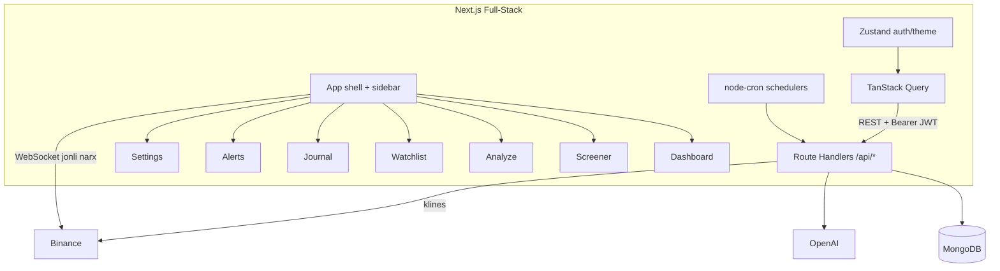

# EasyTrade AI — Kripto Trading Assistant

Professional traderlar uchun mo'ljallangan kripto trading yordamchisi: ko'p
timeframe'li signal (confluence), backtest, watchlist, savdo jurnali,
ogohlantirishlar va grounded AI chat.

## Xususiyatlar

- **Signal engine** — EMA/RSI/ATR, support/resistance (swing-based), 4 strategiya
  (Trend Pullback, Breakout + Retest, EMA Crossover, RSI Divergence), side-aware
  SL/TP va R:R, blended confidence. Sham formatsiyalari (engulfing, hammer,
  shooting star) volume bilan tasdiqlanadi va confidence'ga ta'sir qiladi.
- **Risk-menejment** — pozitsiya hajmi riskdagi puldan hisoblanadi (spot'da
  kapital bilan cheklanadi), futures uchun xavfsiz leverage tavsiyasi
  (likvidatsiya buferi ≥ 3× stop masofasi, maks. 5x) va kerakli margin.
  Futures kirishlari uchun minimal R:R 1:2, spot uchun 1:1.5. Risk foizi
  maksimum 10% bilan cheklangan.
- **Multi-timeframe confluence** — yuqori timeframe trendi filtr sifatida; HTF
  qarama-qarshi bo'lsa `enter` → `wait` ga tushiriladi.
- **Backtest** — 1000 tagacha shamda strategiyalarni qayta o'ynatib win rate,
  o'rtacha R va expectancy hisoblaydi (Mongo'da keshlanadi). SL/TP'ga yetmagan
  savdo 40 shamdan keyin vaqt stopi bilan yopiladi.
- **Auth** — JWT + bcrypt, per-user sozlamalar.
- **Watchlist / Savdo jurnali / Ogohlantirishlar** — MongoDB'da saqlanadi;
  jurnal P&L, R-multiple, win rate, expectancy va equity egri chizig'i.
- **Uzoq muddat investitsiya** — 1-24 oy uchun spot hold tahlili: makro trend
  (kunlik EMA), haftalik RSI, 52 haftalik cho'qqi/tub, DCA rejasi (3 bosqich:
  40/30/30%), maqsadlar va invalidation darajasi.
- **Ogohlantirishlar** — `node-cron` har daqiqada narx / kirish zonasi / signal
  ogohlantirishlarini baholaydi; brauzer bildirishnomalari.
- **UI** — Next.js App Router, sidebar shell, dark mode, jonli narx (Binance
  WebSocket), boyitilgan grafik (EMA, volume, Fibonacci, entry/SL/TP).
- **AI** — statik izoh + streaming (SSE) suhbat yordamchisi (joriy setupga
  asoslangan). OpenAI ixtiyoriy — kalitsiz ham signallar ishlaydi.

## Texnologiyalar

- **Full-stack** — Next.js 16 (App Router + Route Handlers), React 19, TypeScript
  (strict), Mongoose, zod, JWT, bcryptjs, node-cron, OpenAI SDK.
- **UI** — Tailwind v4, shadcn/base-ui, TanStack Query, Zustand, next-themes,
  lightweight-charts, recharts, sonner.

## Arxitektura



### Server tuzilmasi (`frontend/lib/server/`)

```
lib/server/
  config/       env, db, scheduler (cron)
  http/         route adapter, error handling, SSE
  models/       User, Watchlist, Trade, Alert, BacktestResult
  services/     analysis, strategy, patterns, indicators, risk, mtf, backtest,
                screener, binance, openai, auth, watchlist, journal, alert
  validators/   zod sxemalari
  utils/        AppError, token
  __tests__/    Jest testlari
app/api/        Next.js Route Handlers (har bir endpoint)
instrumentation.ts   MongoDB ulanish + cron ishga tushirish
```

### Frontend tuzilmasi

```
frontend/
  app/                 layout, providers, login/register, (app)/* himoyalangan sahifalar,
                       api/* route handlerlar, health
  components/          layout, auth, analyze, screener, watchlist, journal, alerts,
                       dashboard, settings, common, ui (shadcn)
  hooks/               React Query hooklari (market, watchlist, journal, alerts)
  lib/api/             tiplangan API klient (client, auth, market, watchlist,
                       journal, alerts, chat)
  lib/store/           Zustand auth store
  lib/                 format, setup, indicators, binance, positionBoxOverlay
```

## O'rnatish

```bash
cd frontend
npm install
cp .env.example .env.local   # qiymatlarni to'ldiring (MONGODB_URI, JWT_SECRET, ...)
npm run dev                  # http://localhost:3000
```

Muhit o'zgaruvchilari (`.env.local`):

| O'zgaruvchi      | Tavsif                              | Standart                                  |
| ---------------- | ----------------------------------- | ----------------------------------------- |
| `MONGODB_URI`    | MongoDB ulanish satri               | `mongodb://127.0.0.1:27017/easytrade`     |
| `JWT_SECRET`     | JWT imzo kaliti                     | (majburiy o'zgartiring)                   |
| `JWT_EXPIRES_IN` | Token amal qilish muddati           | `7d`                                      |
| `OPENAI_API_KEY` | OpenAI kaliti (ixtiyoriy)           | —                                         |
| `OPENAI_MODEL`   | OpenAI modeli                       | `gpt-4o`                                  |
| `APP_URL`        | Public URL (Render keep-alive ping) | Render'da `RENDER_EXTERNAL_URL` avtomatik |

Render free tier uchun server **har 14 daqiqada** o'z `GET /health` endpointiga ping yuboradi (`200 OK`). Render'da qo'shimcha sozlash shart emas — `RENDER_EXTERNAL_URL` avtomatik ishlatiladi.

**Health check:** `GET /health` → `200 OK`

### Vercel (production)

Vercel → **Project Settings → Environment Variables** da quyidagilar bo'lishi kerak:

| O'zgaruvchi      | Majburiy                                  |
| ---------------- | ----------------------------------------- |
| `MONGODB_URI`    | ✓                                         |
| `JWT_SECRET`     | ✓                                         |
| `JWT_EXPIRES_IN` | ✓                                         |
| `OPENAI_API_KEY` | ixtiyoriy                                 |
| `APP_URL`        | ixtiyoriy (`https://your-app.vercel.app`) |

**O'chiring:** `NEXT_PUBLIC_API_URL` — API endi shu Next.js app ichida, alohida Render backend kerak emas.

O'zgaruvchilarni qo'shgach **Redeploy** qiling.

## Skriptlar

| Buyruq          | Vazifa             |
| --------------- | ------------------ |
| `npm run dev`   | Development server |
| `npm run build` | Production build   |
| `npm start`     | Production server  |
| `npm test`      | Jest testlari      |

## API (asosiy)

| Metod                 | Endpoint               | Auth | Tavsif                    |
| --------------------- | ---------------------- | ---- | ------------------------- |
| POST                  | `/api/auth/register`   | —    | Ro'yxatdan o'tish         |
| POST                  | `/api/auth/login`      | —    | Kirish                    |
| GET                   | `/api/auth/me`         | ✓    | Profil                    |
| PATCH                 | `/api/auth/settings`   | ✓    | Sozlamalarni yangilash    |
| POST                  | `/api/analyze`         | —    | To'liq signal + AI izoh   |
| POST                  | `/api/invest`          | —    | Uzoq muddat DCA tahlili   |
| GET                   | `/api/invest/screener` | —    | Uzoq muddat imkoniyatlari |
| GET                   | `/api/screener`        | —    | Bozor skaneri             |
| GET                   | `/api/backtest`        | —    | Backtest natijalari       |
| GET/POST/DELETE       | `/api/watchlist`       | ✓    | Watchlist CRUD            |
| GET/POST/PATCH/DELETE | `/api/journal`         | ✓    | Savdo jurnali + `/stats`  |
| GET/POST/DELETE       | `/api/alerts`          | ✓    | Ogohlantirishlar CRUD     |
| POST                  | `/api/chat`            | ✓    | Streaming AI chat (SSE)   |

## Xavfsizlik eslatmasi

`.env` git'da kuzatilmaydi. Repozitoriyda haqiqiy maxfiy kalitlar bo'lmasin —
Atlas paroli va OpenAI kalitini muntazam almashtirib turing.

## Testlar

- Server: signal indikatorlari, sham formatsiyalari, pozitsiya hajmi/leverage,
  MTF confluence, backtest statistikasi, JWT token.
- Frontend: format yordamchilari, StatCard (RTL).

```bash
cd frontend && npm test
```
